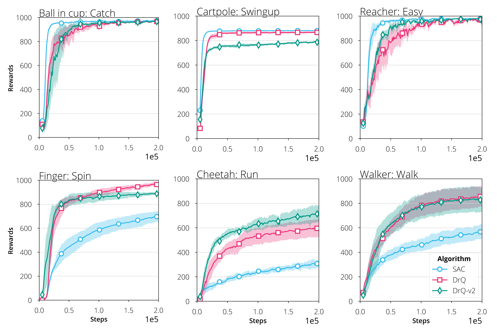

## Installs


```
pip install gym==0.25.0 metaschool simple-parsing wandb dm-control
pip install git+https://github.com/denisyarats/dmc2gym.git

```

## Run

SAC (proprioceptive states):
```
make GPU=0 DOMAIN=cartpole TASK=swingup sac
```

DrQ (vision states):
```
make GPU=0 DOMAIN=cartpole TASK=swingup drq
```

DrQv2 (vision states):
```
make GPU=0 DOMAIN=cartpole TASK=swingup drqv2
```
